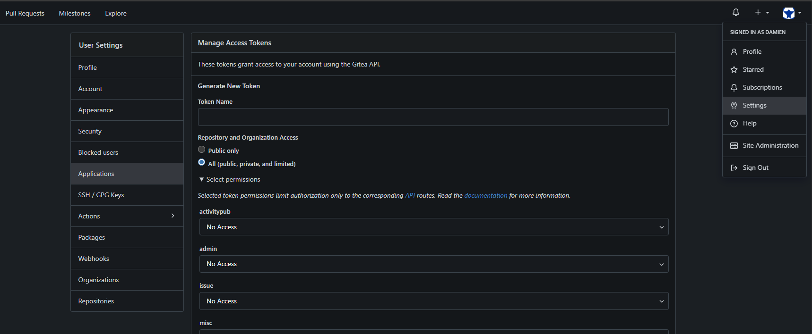
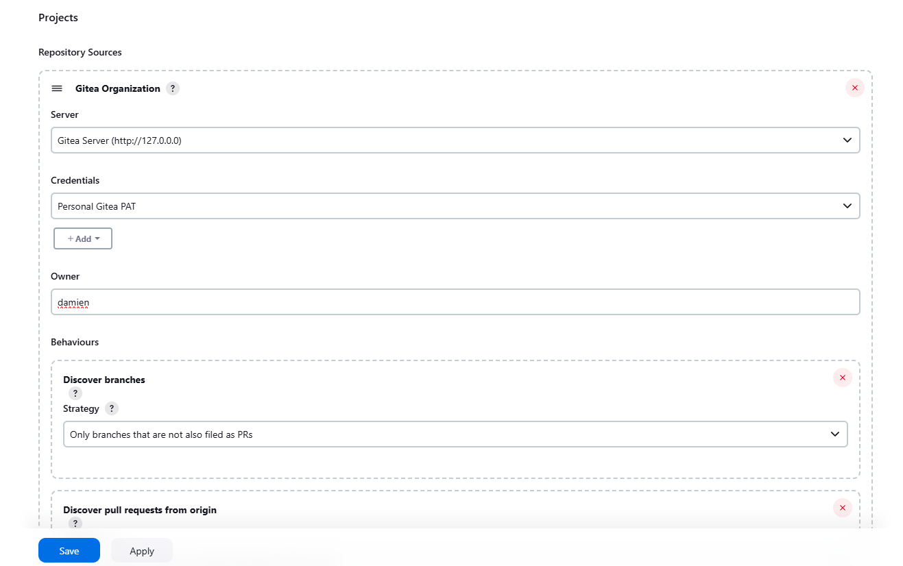

## Overview

In this guide, you will learn how to set up a Jenkins pipeline for the OWASP Juice Shop project, integrating it with Gitea for version control, SonarQube for static code analysis, and Docker for containerization. The process includes cloning the codebase, configuring access tokens in Gitea, installing necessary Jenkins plugins, creating a Jenkins pipeline, and setting up webhooks and SSH keys for secure communication between your systems. By the end of this guide, your pipeline will be fully automated to handle code quality checks, security scans, and deployments.

## Step 1: Clone the Codebase

On your local machine, clone the juice-shop-sonarscanning repository:

```bash
git clone https://github.com/The-DevSec-Blueprint/juice-shop-sonarscanning.git
```

## Step 2: Create a New Project in Gitea

1. Log into your Gitea instance and create a new repository.

    

2. Fill in the repository details:
    - **Repository name**: `owasp-juice-shop`
    - **Visibility**: `public`
    - **Description**: *(Optional)*
    - **Default branch**: `master`

    

3. Click on the **Create Repository** button.

4. Confirm the repository creation.

    

## Step 3: Configure Access Token in Gitea

1. In Gitea, click on your user avatar at the top right, then select **Settings** > **Applications**.

    

2. Enter a token name (e.g., `Jenkins`), set it to `Private`, and select all permissions as READ/WRITE. Click **Generate Token**.

    

3. Copy the token and store it in a secure place. This token will be used for Jenkins authentication.

## Step 4: Install Required Plugins in Jenkins

1. Log into Jenkins. From the **Dashboard**, click **Manage Jenkins** > **Manage Plugins**.

    

2. Under **Available Plugins**, search for and install the following:
    - **Gitea**
    - **SonarQube Scanner**
    - **Docker Pipeline**
    - **SSH Agent**

    

## Step 5: Create Jenkins Pipeline

1. From the Jenkins **Dashboard**, click **New Item**.

    

2. Select **Organization Folder** and name it (e.g., `OWASP Juice Shop Pipeline`).

    

3. Scroll down to **Repository Sources** and select **Gitea Organization**.

    

4. Under **Credentials**, click **Add**. Select the organization folder name, set the **Kind** to **Gitea Personal Access Token (PAT)**, and paste the token generated from Gitea.

    

5. Set the **Owner** to your Gitea username, and then click **Apply** and **Save**.

    

## Step 6: Configure Webhook in Gitea

1. In Jenkins, go to **Manage Jenkins** > **Configure System**. Scroll down to **Gitea Servers** and add your Gitea server details.

    

    - **Discover branches**: Only branches filed as PRs or master/main branch.
    - **Discover pull requests from origin**: Both the current pull request revision and the pull request merged with the current target branch revision.

2. Click **Apply** and **Save**.

3. In Gitea, navigate to the project, click on **Settings** > **Webhooks**.

    

4. Click **Add Webhook**, then select **Gitea**. Fill out the form:
    - **URL**: `<http://localhost:8080/gitea-webhook/post>`
    - **Method**: `POST`
    - **Content Type**: `application/json`
    - **Branch filter**: `*`

    

5. Click **Add Webhook** to save the configuration.

## Step 7: Configure SSH Keys

1. On your local machine (DSB Hub), generate an SSH key pair:

    ```bash
    ssh-keygen -t rsa -b 4096 -C "jenkins@dsb-hub.com"
    ```

    ```plaintext
    Generating public/private rsa key pair.
    Enter file in which to save the key (/home/damien/.ssh/id_rsa): 
    Enter passphrase (empty for no passphrase):
    Enter same passphrase again:
    Your identification has been saved in /home/damien/.ssh/id_rsa
    Your public key has been saved in /home/damien/.ssh/id_rsa.pub
    The key fingerprint is:
    SHA256:iIitv6/AYHsTTND7ooLJtG0M2NZrOWMer7E0E6hZ8XI jenkins@dsb-hub.com
    The key's randomart image is:
    ```

2. Copy the public key to your remote server:

    ```bash
    ssh-copy-id damien@dsb-node-01.local
    ```

3. In Jenkins, go to **Manage Jenkins** > **Credentials** > **System** > **Global Credentials (unrestricted)**. Select **Add Credentials** and choose **SSH Username with private key**.

    

4. Fill out the form and hit **Create** to store your SSH credentials.

## Conclusion

You've now successfully set up a Jenkins pipeline for the OWASP Juice Shop project with Gitea, SonarQube, and Docker integration. Your pipeline is configured to handle code quality checks, security scans, and deployments, ensuring that your application maintains a high standard throughout the development lifecycle.

```

This structure introduces an overview section that provides context and sets expectations for the steps ahead, making the guide more user-friendly and easier to follow. Let me know if you need further modifications!
