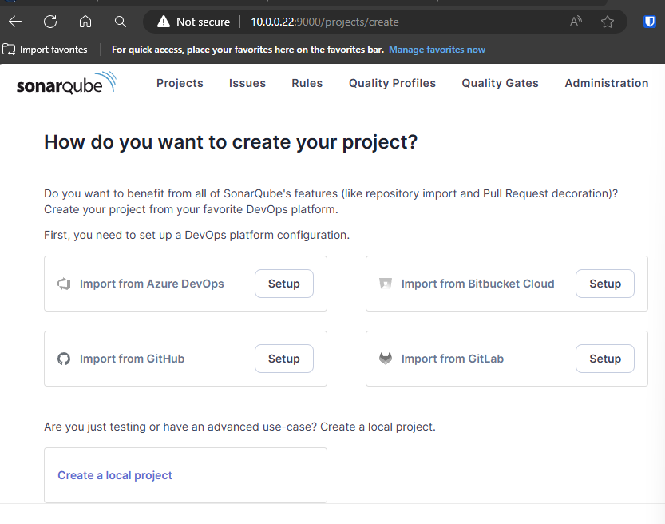

## Overview

>This installation and configuration guide is intended for the `dsb-hub` environment.

## Prerequisites

### 1. Install Java

Before installing Jenkins, ensure that Java is installed on your system:

- Update your package manager and install Java:

  ```bash
  sudo apt update
  sudo apt install fontconfig openjdk-17-jre
  ```

## Installation Steps

### 2. Configure the Package Manager and Install Jenkins

- Add Jenkins to your package manager by downloading and installing the Jenkins key:

  ```bash
  sudo wget -O /usr/share/keyrings/jenkins-keyring.asc https://pkg.jenkins.io/debian-stable/jenkins.io-2023.key
  ```

- Add the Jenkins repository to your sources list:

  ```bash
  echo "deb [signed-by=/usr/share/keyrings/jenkins-keyring.asc] https://pkg.jenkins.io/debian-stable binary/" | sudo tee /etc/apt/sources.list.d/jenkins.list > /dev/null
  ```

- Update your package list and install Jenkins:

  ```bash
  sudo apt-get update
  sudo apt-get install jenkins
  ```

### 3. Enable and Start Jenkins

- Enable Jenkins to start on boot:

  ```bash
  sudo systemctl enable jenkins
  ```

- Start Jenkins:

  ```bash
  sudo systemctl start jenkins
  ```

### 4. Verify Jenkins is Running

- Check the status of Jenkins to ensure it's active:

  ```bash
  sudo systemctl status jenkins
  ```

- You should see output similar to the following if Jenkins is up and running:

  ```bash
  ● jenkins.service - Jenkins Continuous Integration Server
     Loaded: loaded (/usr/lib/systemd/system/jenkins.service; enabled; preset: enabled)
     Active: active (running) since [DATE]; [TIME] ago
     Main PID: 9188 (java)
  ```

## Installing Jenkins Node

>This section covers installing and configuring a Jenkins node on `dsb-node-01`.

### 1. Create Jenkins User

- Create a Jenkins user and set appropriate permissions:

  ```bash
  sudo adduser jenkins
  sudo chown -R jenkins:jenkins /home/jenkins
  sudo chmod 755 /home/jenkins
  sudo usermod -aG docker jenkins
  ```

### 2. Install Java

- Install Java on the Jenkins node:

  ```bash
  sudo apt install openjdk-17-jre-headless
  ```

### 3. Configure the Jenkins Node in Jenkins UI

- In Jenkins UI, navigate to **Dashboard > Manage Jenkins > Nodes**. Click on **New Node**. Select **Permanent Agent** and click **OK**.
  
  

- For your agent, configure the **Remote root directory** to `/home/jenkins/agent` and save the configuration.

### 4. Configure Jenkins Security for Agents

- In Jenkins UI, navigate to **Dashboard > Manage Jenkins > Security**, and scroll down until you see **TCP ports for inbound agents**. Select **Random**. Apply/Save.

  

### 5. Set Up the Jenkins Node

- On `dsb-node-01`, create the agent directory:

  ```bash
  cd /home/jenkins && mkdir agent
  ```

- Download the Jenkins agent JAR file:

  ```bash
  wget http://<jenkins-server-url>/jnlpJars/agent.jar
  ```

- Run the Jenkins agent:

  ```bash
  java -jar agent.jar -jnlpUrl http://<jenkins-server-url>/computer/<node-name>/slave-agent.jnlp -secret <secret-key> -workDir "/home/jenkins/agent"
  ```

>**NOTE**: You can find the secret key on the Jenkins node configuration page.

  

### 6. Create a Systemd Service for the Jenkins Agent

- Create a new systemd service for the Jenkins agent:

  ```bash
  sudo nano /etc/systemd/system/jenkins-agent.service
  ```

- Add the following configuration to the service file:

  ```ini
  [Unit]
  Description=Jenkins Agent

  [Service]
  User=jenkins
  Group=jenkins
  ExecStart=/usr/bin/java -jar /home/jenkins/agent/agent.jar -jnlpUrl http://<jenkins-server-url>/computer/<node-name>/slave-agent.jnlp -secret <secret-key> -workDir /home/jenkins/agent
  Restart=always

  [Install]
  WantedBy=multi-user.target
  ```

- Reload systemd and start the Jenkins agent service:

  ```bash
  sudo systemctl daemon-reload
  sudo systemctl start jenkins-agent
  sudo systemctl enable jenkins-agent
  ```

## Configuration Steps

### 5. Access Jenkins via Web Browser

- Open your web browser and go to:

  ```bash
  http://your_ip:8080
  ```

- You should see the Jenkins setup screen.

  

### 6. Retrieve the Initial Admin Password

- To proceed with the setup, you will need the initial admin password. Retrieve it by running the following command on your server:

  ```bash
  sudo cat /var/lib/jenkins/secrets/initialAdminPassword
  ```

- Copy the password and enter it in the password box on the web interface.

  

### 7. Install Suggested Plugins

- After entering the admin password, click **Install suggested plugins** and allow Jenkins to install the necessary plugins.

  

### 8. Set Up Your Admin Account

- After the plugins are installed, you’ll be prompted to set up your admin account. Enter your details and set up your Jenkins instance.

  

### 9. Jenkins is Ready

- Once the setup is complete, Jenkins is fully configured and ready for use.
