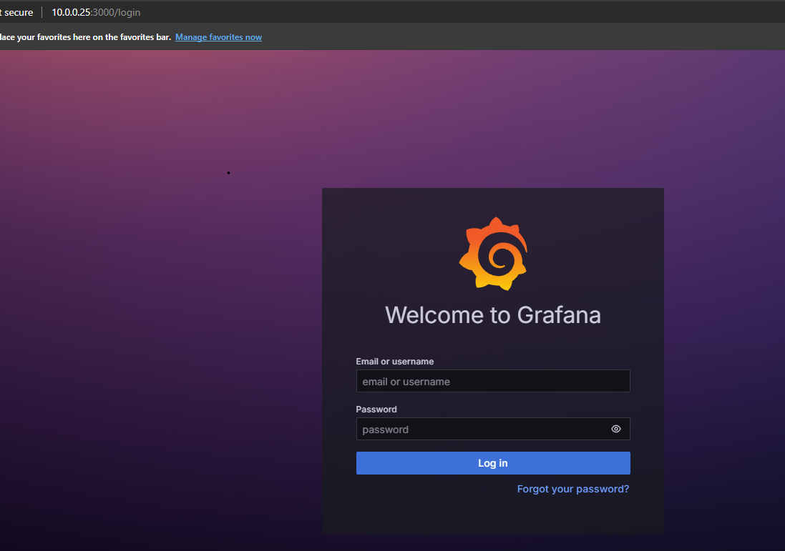
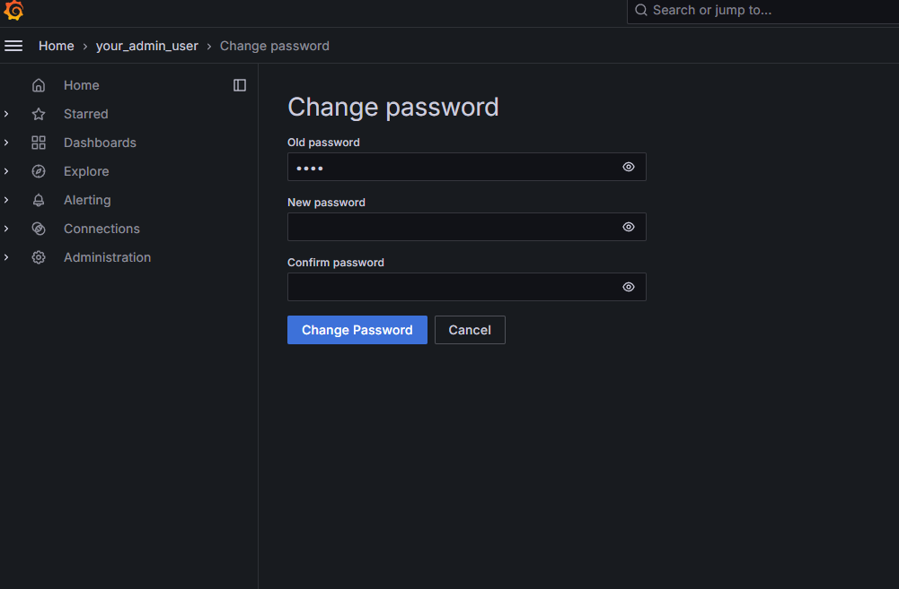

## Overview

> This installation happens on the `dsb-node-01`.

According to [Grafana's Website], Grafana is an open-source platform for monitoring and observability. It allows you to query, visualize, alert on, and understand your metrics no matter where they are stored. Grafana provides a powerful and elegant way to create, explore, and share dashboards that integrate data from various sources, making it an essential tool for DevOps teams to monitor their infrastructure, applications, and services in real time.

## Prerequisites

1. **Install Docker**

   - Install Docker using Snap:

     ```bash
     sudo snap install docker
     ```

2. **Create Docker Group and Add User to It**

   - Create a Docker group and add your user to it:

     ```bash
     sudo groupadd docker
     sudo usermod -aG docker $USER
     sudo reboot
     ```

## Installation Steps

1. **Create a Docker-Compose File for Grafana**

   - Create the necessary directories and Docker-Compose file:

     ```bash
     mkdir -p ~/apps/grafana
     touch ~/apps/grafana/docker-compose.yml
     ```

2. **Copy and Save the Docker-Compose Configuration**

   - Use the following configuration in your `docker-compose.yml` file:

     ```yaml
     version: '3.7'

     services:
       grafana:
         image: grafana/grafana:latest
         container_name: grafana
         ports:
           - "3000:3000"
         environment:
           - GF_SECURITY_ADMIN_PASSWORD=your_admin_password
           - GF_SECURITY_ADMIN_USER=your_admin_user
         volumes:
           - grafana_data:/var/lib/grafana
         restart: always
         network_mode: host
         
     volumes:
       grafana_data:
     ```

   - Open the file with nano or your preferred text editor and paste the configuration:

     ```bash
     nano ~/apps/grafana/docker-compose.yml
     ```

   - Save and close the file.

3. **Run Grafana with Docker-Compose**

   - Navigate to the Grafana directory and run the container:

     ```bash
     cd ~/apps/grafana
     docker-compose up -d
     ```

4. **Confirm Grafana is Running**

   - Check if Grafana is up and running by visiting `http://localhost:3000` in your web browser.

   

## Configuration Steps

1. **Log into the Dashboard**

   - Use your admin username and password to log into the Grafana dashboard.

   

2. **Update Admin Username**

   - Click on your profile and update the admin username.

   

3. **Update Admin Password**

   - Change your password for enhanced security.

   

## You're Done

You’ve successfully installed and configured Grafana on your system.

<!-- Sources -->
[Grafana's Website]: https://grafana.com/docs/grafana/latest/getting-started/what-is-grafana/
