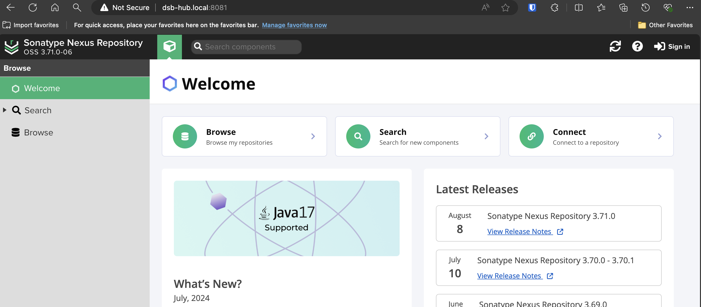

---
---

## Overview
> This installation happens on the `dsb-hub`.

we installed Nexus using docker compose simply because we are using a conflicting JDK version for SonarQube.

## Installation Steps
- create new directory
```
mkdir apps/nexus
mkdir apps/nexus/nexus-data
sudo chown -R 200 nexus-data/
```
- create docker-compose yaml
```
cd apps/nexus
touch docker-compose.yml
```
- add into yaml
```
version: "3"
services:
  nexus:
    image: sonatype/nexus3
    restart: always
    volumes:
      - "./nexus-data:/nexus-data"
    ports:
      - "8081:8081"
      - "8082:8082"
      - "8085:8085"
volumes:
  nexus-data:
    driver: local
```
- run the application
```
docker compose up -d
```

- Confirm the application is up: http://your-ip-address:8081


## Configuration steps

- click the sign in button and locate the admin password:


```
cat nexus-dataxx/admin.password
```

- take the password and log in


- go through the initial setup by changing your password and enabling anonymous access (if you prefer).

- as admin, in the UI, click on create repository


- click on 'Docker proxy', and enter in the following information:
1. Name: docker-proxy
2. Remote Storage Proxy URL: https://registry.hub.docker.com
3. Docker Index: Docker Hub
4. Allow Anonymous Pulls
5. Set HTTP to 8082

- create local user and set to nx-anonymous, and click create:


# You're done!

You've setup your Nexus server.